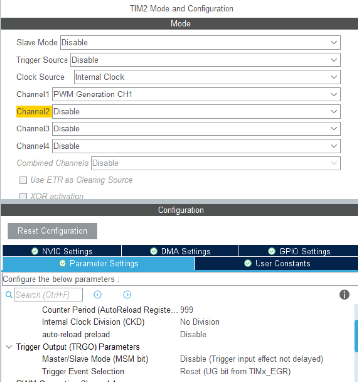
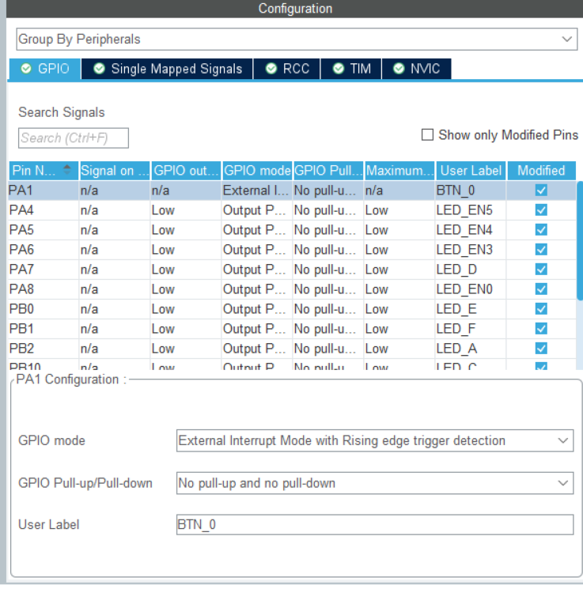
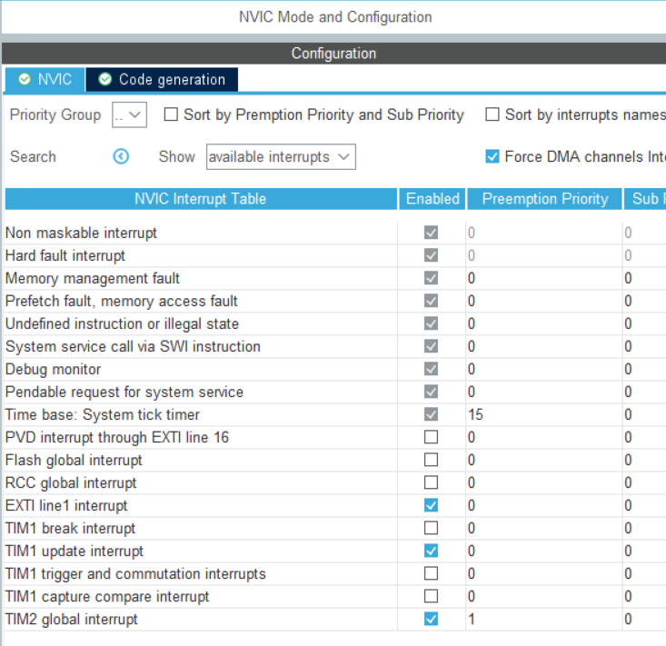

# BUPT-COURSE-STM32-Timer
单片机C语言 音乐计时器的设计

本项目基于 CubeMXIDE生成代码

## 1. 项目简介

1. 实现一个PWM调控的蜂鸣器 
2. 实现一个ms计时器

## 2. 实现原理
### 硬件接线

### 生成代码
1. 分配管脚

2. 配置定时器【分频设置 计时周期设置 PWM设置】

3. 配置按键中断

4. 配置中断等级

### 代码实现
0. 初始化
    启动2个定时器
    注册中断
1. 定时器1中断服务函数
对ms【全局变量】进行计时
2. BEEP() 发声函数
3. DisplayDriver() 显示函数

细节参见代码Src/main.c